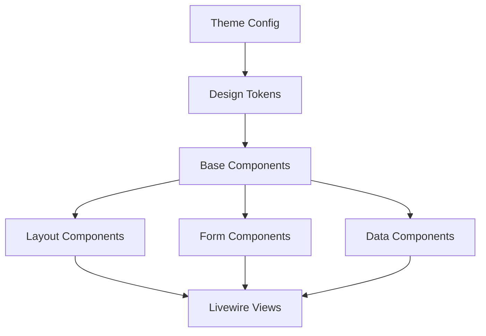

# Design Document - Tailwind Styling Optimization

## Overview

Dokumen ini menjelaskan desain komprehensif untuk mengoptimasi seluruh styling aplikasi SIKOPMA menggunakan Tailwind CSS v4 dengan best practices. Tujuan utama adalah menciptakan design system yang konsisten, maintainable, dan performant dengan menghilangkan custom CSS classes dan menggantinya dengan utility-first approach menggunakan Tailwind CSS.

### Current State Analysis

**Existing Setup:**
- Tailwind CSS v4.1.17 dengan Vite plugin
- @tailwindcss/forms plugin untuk form styling
- Alpine.js v3.15.1 untuk interactivity
- Laravel Livewire untuk reactive components
- Custom CSS classes di app.css (.btn, .btn-primary, .input)
- Blade components yang sudah ada (button, card, input, select, badge, navigation)
- 60+ Livewire view files yang perlu dioptimasi

**Problems Identified:**
1. Custom CSS classes yang redundant dengan Tailwind utilities
2. Inconsistent component variants dan props
3. Hardcoded Tailwind classes di Livewire views (tidak reusable)
4. Tidak ada centralized theme configuration
5. Tidak ada design system documentation
6. Inconsistent spacing, colors, dan typography

### Goals

1. **Consistency**: Semua UI components menggunakan design tokens yang sama
2. **Maintainability**: Mudah update styling dari satu tempat (theme config)
3. **Performance**: Minimal CSS bundle size dengan JIT mode
4. **Developer Experience**: Component library yang lengkap dan terdokumentasi
5. **Accessibility**: Semantic HTML dan ARIA attributes
6. **Responsiveness**: Mobile-first approach dengan consistent breakpoints


## Architecture

### Design System Structure

```
.kiro/specs/tailwind-styling-optimization/
├── design-system.md          # Design system documentation
├── component-library.md      # Component usage guide
└── migration-guide.md        # Step-by-step migration guide

tailwind.config.js            # Theme configuration (extended)
resources/
├── css/
│   └── app.css              # Minimal custom CSS (< 50 lines)
└── views/
    ├── components/          # Blade components (reusable)
    │   ├── ui/             # Basic UI components
    │   │   ├── button.blade.php
    │   │   ├── input.blade.php
    │   │   ├── select.blade.php
    │   │   ├── textarea.blade.php
    │   │   ├── checkbox.blade.php
    │   │   ├── radio.blade.php
    │   │   ├── badge.blade.php
    │   │   ├── alert.blade.php
    │   │   ├── card.blade.php
    │   │   ├── modal.blade.php
    │   │   ├── dropdown.blade.php
    │   │   ├── tooltip.blade.php
    │   │   ├── avatar.blade.php
    │   │   ├── skeleton.blade.php
    │   │   └── spinner.blade.php
    │   ├── layout/         # Layout components
    │   │   ├── page-header.blade.php
    │   │   ├── form-section.blade.php
    │   │   ├── grid.blade.php
    │   │   ├── empty-state.blade.php
    │   │   └── stat-card.blade.php
    │   └── data/           # Data display components
    │       ├── table.blade.php
    │       ├── pagination.blade.php
    │       ├── tabs.blade.php
    │       └── breadcrumb.blade.php
    └── livewire/           # Livewire components (refactored)
```

### Component Hierarchy




## Components and Interfaces

### 1. Theme Configuration (tailwind.config.js)

**Extended Configuration:**

```javascript
export default {
  content: [
    "./resources/**/*.blade.php",
    "./resources/**/*.js",
    "./resources/**/*.vue",
    "./app/Livewire/**/*.php",
  ],
  theme: {
    extend: {
      colors: {
        // Brand colors untuk SIKOPMA
        primary: {
          50: '#eef2ff',
          100: '#e0e7ff',
          200: '#c7d2fe',
          300: '#a5b4fc',
          400: '#818cf8',
          500: '#6366f1',  // Main brand color
          600: '#4f46e5',
          700: '#4338ca',
          800: '#3730a3',
          900: '#312e81',
          950: '#1e1b4b',
        },
        secondary: {
          50: '#f0fdf4',
          100: '#dcfce7',
          200: '#bbf7d0',
          300: '#86efac',
          400: '#4ade80',
          500: '#22c55e',
          600: '#16a34a',
          700: '#15803d',
          800: '#166534',
          900: '#14532d',
          950: '#052e16',
        },
        // Semantic colors
        success: {
          50: '#f0fdf4',
          500: '#22c55e',
          700: '#15803d',
        },
        danger: {
          50: '#fef2f2',
          500: '#ef4444',
          700: '#b91c1c',
        },
        warning: {
          50: '#fffbeb',
          500: '#f59e0b',
          700: '#b45309',
        },
        info: {
          50: '#eff6ff',
          500: '#3b82f6',
          700: '#1d4ed8',
        },
      },
      fontFamily: {
        sans: ['Instrument Sans', 'system-ui', 'sans-serif'],
      },
      spacing: {
        '18': '4.5rem',
        '88': '22rem',
        '128': '32rem',
      },
      borderRadius: {
        '4xl': '2rem',
      },
      boxShadow: {
        'soft': '0 2px 15px -3px rgba(0, 0, 0, 0.07), 0 10px 20px -2px rgba(0, 0, 0, 0.04)',
        'soft-lg': '0 10px 40px -10px rgba(0, 0, 0, 0.1)',
      },
      animation: {
        'slide-in': 'slideIn 0.3s ease-out',
        'fade-in': 'fadeIn 0.2s ease-out',
      },
      keyframes: {
        slideIn: {
          '0%': { transform: 'translateY(-10px)', opacity: '0' },
          '100%': { transform: 'translateY(0)', opacity: '1' },
        },
        fadeIn: {
          '0%': { opacity: '0' },
          '100%': { opacity: '1' },
        },
      },
    },
  },
  plugins: [
    require('@tailwindcss/forms'),
  ],
}
```


### 2. Base UI Components

#### Button Component (resources/views/components/ui/button.blade.php)

**Props:**
- `variant`: primary, secondary, success, danger, warning, info, white, outline, ghost
- `size`: sm, md, lg
- `type`: button, submit, reset
- `loading`: boolean
- `disabled`: boolean
- `icon`: string (optional icon name)

**Implementation Pattern:**
```php
@props([
    'variant' => 'primary',
    'size' => 'md',
    'type' => 'button',
    'loading' => false,
    'disabled' => false,
    'icon' => null,
])

@php
$variants = [
    'primary' => 'bg-primary-600 hover:bg-primary-700 text-white focus:ring-primary-500',
    'secondary' => 'bg-secondary-600 hover:bg-secondary-700 text-white focus:ring-secondary-500',
    'success' => 'bg-success-500 hover:bg-success-700 text-white focus:ring-success-500',
    'danger' => 'bg-danger-500 hover:bg-danger-700 text-white focus:ring-danger-500',
    'warning' => 'bg-warning-500 hover:bg-warning-700 text-white focus:ring-warning-500',
    'info' => 'bg-info-500 hover:bg-info-700 text-white focus:ring-info-500',
    'white' => 'bg-white text-gray-700 border border-gray-300 hover:bg-gray-50 focus:ring-primary-500',
    'outline' => 'bg-transparent border-2 border-primary-600 text-primary-600 hover:bg-primary-50 focus:ring-primary-500',
    'ghost' => 'bg-transparent text-gray-700 hover:bg-gray-100 focus:ring-gray-500',
];

$sizes = [
    'sm' => 'px-3 py-1.5 text-xs',
    'md' => 'px-4 py-2 text-sm',
    'lg' => 'px-6 py-3 text-base',
];

$baseClasses = 'inline-flex items-center justify-center font-semibold rounded-lg transition-all duration-200 focus:outline-none focus:ring-2 focus:ring-offset-2 disabled:opacity-50 disabled:cursor-not-allowed';
@endphp

<button
    type="{{ $type }}"
    {{ $attributes->merge(['class' => implode(' ', [$baseClasses, $variants[$variant], $sizes[$size]])]) }}
    @if($loading || $disabled) disabled @endif
>
    @if($loading)
        <x-ui.spinner class="mr-2" size="sm" />
    @elseif($icon)
        <x-ui.icon :name="$icon" class="mr-2 w-5 h-5" />
    @endif
    {{ $slot }}
</button>
```


#### Input Component (resources/views/components/ui/input.blade.php)

**Props:**
- `label`: string (optional)
- `name`: string (required)
- `type`: text, email, password, number, tel, url, date
- `placeholder`: string
- `required`: boolean
- `disabled`: boolean
- `error`: string (error message)
- `help`: string (help text)
- `icon`: string (optional leading icon)

**Implementation Pattern:**
```php
@props([
    'label' => null,
    'name' => '',
    'type' => 'text',
    'placeholder' => '',
    'required' => false,
    'disabled' => false,
    'error' => null,
    'help' => null,
    'icon' => null,
])

<div class="space-y-1">
    @if($label)
    <label for="{{ $name }}" class="block text-sm font-medium text-gray-700">
        {{ $label }}
        @if($required)
        <span class="text-danger-500">*</span>
        @endif
    </label>
    @endif

    <div class="relative">
        @if($icon)
        <div class="absolute inset-y-0 left-0 pl-3 flex items-center pointer-events-none">
            <x-ui.icon :name="$icon" class="h-5 w-5 text-gray-400" />
        </div>
        @endif
        
        <input
            type="{{ $type }}"
            id="{{ $name }}"
            name="{{ $name }}"
            placeholder="{{ $placeholder }}"
            @if($required) required @endif
            @if($disabled) disabled @endif
            {{ $attributes->merge([
                'class' => implode(' ', [
                    'block w-full rounded-lg border shadow-sm transition-colors duration-200',
                    'focus:outline-none focus:ring-2 focus:ring-offset-0',
                    'disabled:bg-gray-50 disabled:text-gray-500 disabled:cursor-not-allowed',
                    $icon ? 'pl-10' : 'px-3',
                    'py-2 text-sm',
                    $error 
                        ? 'border-danger-300 text-danger-900 placeholder-danger-300 focus:border-danger-500 focus:ring-danger-500' 
                        : 'border-gray-300 focus:border-primary-500 focus:ring-primary-500'
                ])
            ]) }}
        >
    </div>

    @if($help && !$error)
    <p class="text-xs text-gray-500">{{ $help }}</p>
    @endif

    @if($error)
    <p class="text-xs text-danger-600 flex items-center">
        <x-ui.icon name="exclamation-circle" class="w-4 h-4 mr-1" />
        {{ $error }}
    </p>
    @endif
</div>
```


#### Card Component (resources/views/components/ui/card.blade.php)

**Props:**
- `title`: string (optional)
- `subtitle`: string (optional)
- `footer`: slot (optional)
- `padding`: boolean (default: true)
- `shadow`: sm, md, lg, none

**Implementation Pattern:**
```php
@props([
    'title' => null,
    'subtitle' => null,
    'padding' => true,
    'shadow' => 'md',
])

@php
$shadows = [
    'none' => '',
    'sm' => 'shadow-sm',
    'md' => 'shadow-md',
    'lg' => 'shadow-lg',
];
@endphp

<div {{ $attributes->merge(['class' => 'bg-white rounded-lg border border-gray-200 overflow-hidden ' . $shadows[$shadow]]) }}>
    @if($title || $subtitle)
    <div class="px-6 py-4 border-b border-gray-200 bg-gray-50">
        @if($title)
        <h3 class="text-lg font-semibold text-gray-900">{{ $title }}</h3>
        @endif
        @if($subtitle)
        <p class="mt-1 text-sm text-gray-500">{{ $subtitle }}</p>
        @endif
    </div>
    @endif

    <div @class(['px-6 py-4' => $padding])>
        {{ $slot }}
    </div>

    @isset($footer)
    <div class="px-6 py-4 bg-gray-50 border-t border-gray-200">
        {{ $footer }}
    </div>
    @endisset
</div>
```

#### Badge Component (resources/views/components/ui/badge.blade.php)

**Props:**
- `variant`: primary, secondary, success, danger, warning, info, gray
- `size`: sm, md, lg
- `rounded`: boolean (pill shape)

**Implementation Pattern:**
```php
@props([
    'variant' => 'primary',
    'size' => 'md',
    'rounded' => false,
])

@php
$variants = [
    'primary' => 'bg-primary-100 text-primary-800 border-primary-200',
    'secondary' => 'bg-secondary-100 text-secondary-800 border-secondary-200',
    'success' => 'bg-success-50 text-success-700 border-success-200',
    'danger' => 'bg-danger-50 text-danger-700 border-danger-200',
    'warning' => 'bg-warning-50 text-warning-700 border-warning-200',
    'info' => 'bg-info-50 text-info-700 border-info-200',
    'gray' => 'bg-gray-100 text-gray-700 border-gray-200',
];

$sizes = [
    'sm' => 'px-2 py-0.5 text-xs',
    'md' => 'px-2.5 py-1 text-sm',
    'lg' => 'px-3 py-1.5 text-base',
];
@endphp

<span {{ $attributes->merge([
    'class' => implode(' ', [
        'inline-flex items-center font-medium border',
        $rounded ? 'rounded-full' : 'rounded-md',
        $variants[$variant],
        $sizes[$size],
    ])
]) }}>
    {{ $slot }}
</span>
```


#### Alert Component (resources/views/components/ui/alert.blade.php)

**Props:**
- `variant`: success, danger, warning, info
- `dismissible`: boolean
- `icon`: boolean (show icon)

**Implementation Pattern:**
```php
@props([
    'variant' => 'info',
    'dismissible' => false,
    'icon' => true,
])

@php
$variants = [
    'success' => [
        'container' => 'bg-success-50 border-success-200 text-success-800',
        'icon' => 'check-circle',
        'iconColor' => 'text-success-400',
    ],
    'danger' => [
        'container' => 'bg-danger-50 border-danger-200 text-danger-800',
        'icon' => 'x-circle',
        'iconColor' => 'text-danger-400',
    ],
    'warning' => [
        'container' => 'bg-warning-50 border-warning-200 text-warning-800',
        'icon' => 'exclamation-triangle',
        'iconColor' => 'text-warning-400',
    ],
    'info' => [
        'container' => 'bg-info-50 border-info-200 text-info-800',
        'icon' => 'information-circle',
        'iconColor' => 'text-info-400',
    ],
];

$config = $variants[$variant];
@endphp

<div 
    x-data="{ show: true }" 
    x-show="show"
    x-transition:enter="transition ease-out duration-300"
    x-transition:enter-start="opacity-0 transform scale-95"
    x-transition:enter-end="opacity-100 transform scale-100"
    x-transition:leave="transition ease-in duration-200"
    x-transition:leave-start="opacity-100 transform scale-100"
    x-transition:leave-end="opacity-0 transform scale-95"
    {{ $attributes->merge(['class' => 'border-l-4 p-4 rounded-lg ' . $config['container']]) }}
>
    <div class="flex items-start">
        @if($icon)
        <div class="flex-shrink-0">
            <x-ui.icon :name="$config['icon']" class="h-5 w-5 {{ $config['iconColor'] }}" />
        </div>
        @endif
        
        <div @class(['ml-3' => $icon, 'flex-1'])>
            {{ $slot }}
        </div>

        @if($dismissible)
        <button 
            @click="show = false"
            type="button" 
            class="ml-auto flex-shrink-0 inline-flex text-gray-400 hover:text-gray-600 focus:outline-none focus:ring-2 focus:ring-offset-2 focus:ring-primary-500 rounded-lg p-1"
        >
            <x-ui.icon name="x" class="h-5 w-5" />
        </button>
        @endif
    </div>
</div>
```


### 3. Layout Components

#### Page Header Component (resources/views/components/layout/page-header.blade.php)

**Props:**
- `title`: string (required)
- `description`: string (optional)
- `actions`: slot (optional - for buttons/actions)
- `breadcrumbs`: array (optional)

**Implementation Pattern:**
```php
@props([
    'title' => '',
    'description' => null,
    'breadcrumbs' => [],
])

<div class="mb-6">
    @if(count($breadcrumbs) > 0)
    <nav class="mb-4">
        <ol class="flex items-center space-x-2 text-sm">
            @foreach($breadcrumbs as $index => $crumb)
                <li class="flex items-center">
                    @if($index > 0)
                    <x-ui.icon name="chevron-right" class="w-4 h-4 text-gray-400 mx-2" />
                    @endif
                    @if(isset($crumb['url']))
                    <a href="{{ $crumb['url'] }}" class="text-gray-500 hover:text-gray-700">
                        {{ $crumb['label'] }}
                    </a>
                    @else
                    <span class="text-gray-900 font-medium">{{ $crumb['label'] }}</span>
                    @endif
                </li>
            @endforeach
        </ol>
    </nav>
    @endif

    <div class="flex items-center justify-between">
        <div class="flex-1 min-w-0">
            <h1 class="text-2xl font-bold text-gray-900 sm:text-3xl">
                {{ $title }}
            </h1>
            @if($description)
            <p class="mt-2 text-sm text-gray-600">
                {{ $description }}
            </p>
            @endif
        </div>

        @isset($actions)
        <div class="flex items-center space-x-3 ml-4">
            {{ $actions }}
        </div>
        @endisset
    </div>
</div>
```

#### Stat Card Component (resources/views/components/layout/stat-card.blade.php)

**Props:**
- `label`: string
- `value`: string/number
- `icon`: string
- `iconColor`: string (bg color class)
- `trend`: string (optional - e.g., "+12%")
- `trendUp`: boolean

**Implementation Pattern:**
```php
@props([
    'label' => '',
    'value' => '',
    'icon' => null,
    'iconColor' => 'bg-primary-100',
    'iconTextColor' => 'text-primary-600',
    'trend' => null,
    'trendUp' => true,
    'subtitle' => null,
])

<div {{ $attributes->merge(['class' => 'bg-white rounded-lg shadow-md p-5 hover:shadow-lg transition-shadow']) }}>
    <div class="flex items-center">
        @if($icon)
        <div class="flex-shrink-0 {{ $iconColor }} rounded-lg p-3">
            <x-ui.icon :name="$icon" class="w-6 h-6 {{ $iconTextColor }}" />
        </div>
        @endif
        
        <div @class(['ml-5 flex-1' => $icon, 'flex-1' => !$icon])>
            <dt class="text-sm font-medium text-gray-500 truncate">{{ $label }}</dt>
            <dd class="mt-1 text-2xl font-semibold text-gray-900">{{ $value }}</dd>
            
            @if($subtitle)
            <dd class="mt-1 text-xs text-gray-500">{{ $subtitle }}</dd>
            @endif
            
            @if($trend)
            <dd class="mt-2 flex items-center text-sm">
                <span @class([
                    'font-medium',
                    'text-success-600' => $trendUp,
                    'text-danger-600' => !$trendUp,
                ])>
                    @if($trendUp)
                    <x-ui.icon name="arrow-up" class="w-4 h-4 inline" />
                    @else
                    <x-ui.icon name="arrow-down" class="w-4 h-4 inline" />
                    @endif
                    {{ $trend }}
                </span>
            </dd>
            @endif
        </div>
    </div>
</div>
```


#### Empty State Component (resources/views/components/layout/empty-state.blade.php)

**Props:**
- `icon`: string
- `title`: string
- `description`: string
- `action`: slot (optional button)

**Implementation Pattern:**
```php
@props([
    'icon' => 'inbox',
    'title' => 'Tidak ada data',
    'description' => null,
])

<div {{ $attributes->merge(['class' => 'text-center py-12']) }}>
    <x-ui.icon :name="$icon" class="mx-auto h-12 w-12 text-gray-400" />
    <h3 class="mt-4 text-sm font-medium text-gray-900">{{ $title }}</h3>
    @if($description)
    <p class="mt-2 text-sm text-gray-500">{{ $description }}</p>
    @endif
    @isset($action)
    <div class="mt-6">
        {{ $action }}
    </div>
    @endisset
</div>
```

#### Form Section Component (resources/views/components/layout/form-section.blade.php)

**Props:**
- `title`: string
- `description`: string (optional)

**Implementation Pattern:**
```php
@props([
    'title' => '',
    'description' => null,
])

<div {{ $attributes->merge(['class' => 'space-y-6']) }}>
    @if($title)
    <div class="border-b border-gray-200 pb-4">
        <h3 class="text-lg font-medium text-gray-900">{{ $title }}</h3>
        @if($description)
        <p class="mt-1 text-sm text-gray-500">{{ $description }}</p>
        @endif
    </div>
    @endif
    
    <div class="space-y-4">
        {{ $slot }}
    </div>
</div>
```

### 4. Data Display Components

#### Table Component (resources/views/components/data/table.blade.php)

**Props:**
- `headers`: array
- `striped`: boolean
- `hoverable`: boolean

**Implementation Pattern:**
```php
@props([
    'headers' => [],
    'striped' => true,
    'hoverable' => true,
])

<div {{ $attributes->merge(['class' => 'overflow-x-auto']) }}>
    <table class="min-w-full divide-y divide-gray-200">
        @if(count($headers) > 0)
        <thead class="bg-gray-50">
            <tr>
                @foreach($headers as $header)
                <th scope="col" class="px-6 py-3 text-left text-xs font-medium text-gray-500 uppercase tracking-wider">
                    {{ $header }}
                </th>
                @endforeach
            </tr>
        </thead>
        @endif
        
        <tbody @class([
            'bg-white divide-y divide-gray-200',
            'divide-y-0' => $striped,
        ])>
            {{ $slot }}
        </tbody>
    </table>
</div>
```

**Table Row Component (resources/views/components/data/table-row.blade.php):**
```php
@props([
    'striped' => true,
    'hoverable' => true,
])

<tr {{ $attributes->merge([
    'class' => implode(' ', array_filter([
        $striped ? 'odd:bg-white even:bg-gray-50' : '',
        $hoverable ? 'hover:bg-gray-100 transition-colors' : '',
    ]))
]) }}>
    {{ $slot }}
</tr>
```

**Table Cell Component (resources/views/components/data/table-cell.blade.php):**
```php
@props([
    'header' => false,
])

@if($header)
<th {{ $attributes->merge(['class' => 'px-6 py-4 text-left text-sm font-medium text-gray-900']) }}>
    {{ $slot }}
</th>
@else
<td {{ $attributes->merge(['class' => 'px-6 py-4 text-sm text-gray-700']) }}>
    {{ $slot }}
</td>
@endif
```


#### Modal Component (resources/views/components/ui/modal.blade.php)

**Props:**
- `name`: string (unique identifier)
- `title`: string
- `maxWidth`: sm, md, lg, xl, 2xl
- `closeable`: boolean

**Implementation Pattern:**
```php
@props([
    'name' => 'modal',
    'title' => '',
    'maxWidth' => 'lg',
    'closeable' => true,
])

@php
$maxWidths = [
    'sm' => 'max-w-sm',
    'md' => 'max-w-md',
    'lg' => 'max-w-lg',
    'xl' => 'max-w-xl',
    '2xl' => 'max-w-2xl',
];
@endphp

<div
    x-data="{ show: false }"
    x-on:open-modal-{{ $name }}.window="show = true"
    x-on:close-modal-{{ $name }}.window="show = false"
    x-on:keydown.escape.window="show = false"
    x-show="show"
    class="fixed inset-0 z-50 overflow-y-auto"
    style="display: none;"
>
    <!-- Backdrop -->
    <div 
        x-show="show"
        x-transition:enter="transition ease-out duration-300"
        x-transition:enter-start="opacity-0"
        x-transition:enter-end="opacity-100"
        x-transition:leave="transition ease-in duration-200"
        x-transition:leave-start="opacity-100"
        x-transition:leave-end="opacity-0"
        class="fixed inset-0 bg-gray-500 bg-opacity-75"
        @if($closeable) @click="show = false" @endif
    ></div>

    <!-- Modal -->
    <div class="flex items-center justify-center min-h-screen px-4 pt-4 pb-20 text-center sm:p-0">
        <div
            x-show="show"
            x-transition:enter="transition ease-out duration-300"
            x-transition:enter-start="opacity-0 transform translate-y-4 sm:translate-y-0 sm:scale-95"
            x-transition:enter-end="opacity-100 transform translate-y-0 sm:scale-100"
            x-transition:leave="transition ease-in duration-200"
            x-transition:leave-start="opacity-100 transform translate-y-0 sm:scale-100"
            x-transition:leave-end="opacity-0 transform translate-y-4 sm:translate-y-0 sm:scale-95"
            {{ $attributes->merge(['class' => 'inline-block align-bottom bg-white rounded-lg text-left overflow-hidden shadow-xl transform transition-all sm:my-8 sm:align-middle w-full ' . $maxWidths[$maxWidth]]) }}
        >
            <!-- Header -->
            @if($title)
            <div class="px-6 py-4 border-b border-gray-200 flex items-center justify-between">
                <h3 class="text-lg font-semibold text-gray-900">{{ $title }}</h3>
                @if($closeable)
                <button 
                    @click="show = false"
                    type="button"
                    class="text-gray-400 hover:text-gray-600 focus:outline-none focus:ring-2 focus:ring-primary-500 rounded-lg p-1"
                >
                    <x-ui.icon name="x" class="w-5 h-5" />
                </button>
                @endif
            </div>
            @endif

            <!-- Body -->
            <div class="px-6 py-4">
                {{ $slot }}
            </div>

            <!-- Footer -->
            @isset($footer)
            <div class="px-6 py-4 bg-gray-50 border-t border-gray-200 flex items-center justify-end space-x-3">
                {{ $footer }}
            </div>
            @endisset
        </div>
    </div>
</div>
```


#### Spinner Component (resources/views/components/ui/spinner.blade.php)

**Props:**
- `size`: sm, md, lg
- `color`: primary, white, gray

**Implementation Pattern:**
```php
@props([
    'size' => 'md',
    'color' => 'primary',
])

@php
$sizes = [
    'sm' => 'w-4 h-4',
    'md' => 'w-6 h-6',
    'lg' => 'w-8 h-8',
];

$colors = [
    'primary' => 'text-primary-600',
    'white' => 'text-white',
    'gray' => 'text-gray-600',
];
@endphp

<svg 
    {{ $attributes->merge(['class' => 'animate-spin ' . $sizes[$size] . ' ' . $colors[$color]]) }}
    xmlns="http://www.w3.org/2000/svg" 
    fill="none" 
    viewBox="0 0 24 24"
>
    <circle class="opacity-25" cx="12" cy="12" r="10" stroke="currentColor" stroke-width="4"></circle>
    <path class="opacity-75" fill="currentColor" d="M4 12a8 8 0 018-8V0C5.373 0 0 5.373 0 12h4zm2 5.291A7.962 7.962 0 014 12H0c0 3.042 1.135 5.824 3 7.938l3-2.647z"></path>
</svg>
```

#### Avatar Component (resources/views/components/ui/avatar.blade.php)

**Props:**
- `src`: string (image URL)
- `name`: string (for initials fallback)
- `size`: sm, md, lg, xl

**Implementation Pattern:**
```php
@props([
    'src' => null,
    'name' => '',
    'size' => 'md',
])

@php
$sizes = [
    'sm' => 'w-8 h-8 text-xs',
    'md' => 'w-10 h-10 text-sm',
    'lg' => 'w-12 h-12 text-base',
    'xl' => 'w-16 h-16 text-xl',
];

$initials = collect(explode(' ', $name))
    ->map(fn($word) => strtoupper(substr($word, 0, 1)))
    ->take(2)
    ->join('');
@endphp

<div {{ $attributes->merge(['class' => 'inline-flex items-center justify-center rounded-full overflow-hidden bg-primary-500 text-white font-semibold ' . $sizes[$size]]) }}>
    @if($src)
        
    @else
        <span>{{ $initials }}</span>
    @endif
</div>
```

#### Skeleton Component (resources/views/components/ui/skeleton.blade.php)

**Props:**
- `type`: text, circle, rectangle
- `width`: string (Tailwind width class)
- `height`: string (Tailwind height class)

**Implementation Pattern:**
```php
@props([
    'type' => 'text',
    'width' => 'w-full',
    'height' => 'h-4',
])

@php
$typeClasses = [
    'text' => 'rounded',
    'circle' => 'rounded-full',
    'rectangle' => 'rounded-lg',
];
@endphp

<div {{ $attributes->merge([
    'class' => implode(' ', [
        'animate-pulse bg-gray-200',
        $typeClasses[$type],
        $width,
        $height,
    ])
]) }}></div>
```


## Data Models

### Component Props Schema

Setiap component memiliki props yang terdefinisi dengan jelas untuk memastikan konsistensi:

**Standard Props Pattern:**
```php
[
    'variant' => 'primary|secondary|success|danger|warning|info|white|outline|ghost',
    'size' => 'sm|md|lg',
    'disabled' => 'boolean',
    'loading' => 'boolean',
    'error' => 'string|null',
]
```

**Color Variants Mapping:**
```php
$colorVariants = [
    'primary' => [
        'bg' => 'bg-primary-600',
        'hover' => 'hover:bg-primary-700',
        'text' => 'text-white',
        'ring' => 'focus:ring-primary-500',
        'border' => 'border-primary-600',
    ],
    'success' => [
        'bg' => 'bg-success-500',
        'hover' => 'hover:bg-success-700',
        'text' => 'text-white',
        'ring' => 'focus:ring-success-500',
        'border' => 'border-success-500',
    ],
    // ... similar for other variants
];
```

### Design Tokens

**Spacing Scale:**
- xs: 0.5rem (8px)
- sm: 0.75rem (12px)
- md: 1rem (16px)
- lg: 1.5rem (24px)
- xl: 2rem (32px)

**Typography Scale:**
- xs: 0.75rem (12px)
- sm: 0.875rem (14px)
- base: 1rem (16px)
- lg: 1.125rem (18px)
- xl: 1.25rem (20px)
- 2xl: 1.5rem (24px)
- 3xl: 1.875rem (30px)

**Border Radius:**
- sm: 0.25rem (4px)
- md: 0.375rem (6px)
- lg: 0.5rem (8px)
- xl: 0.75rem (12px)
- 2xl: 1rem (16px)


## Error Handling

### Component Error States

**Input Validation Errors:**
```php
// Error state styling
'border-danger-300 text-danger-900 placeholder-danger-300 focus:border-danger-500 focus:ring-danger-500'

// Error message display
<p class="text-xs text-danger-600 flex items-center">
    <x-ui.icon name="exclamation-circle" class="w-4 h-4 mr-1" />
    {{ $error }}
</p>
```

**Form Submission Errors:**
```php
// Alert component untuk global errors
<x-ui.alert variant="danger" dismissible>
    <strong>Error!</strong> {{ $errorMessage }}
</x-ui.alert>
```

**Loading States:**
```php
// Button loading state
<x-ui.button variant="primary" loading="{{ $isLoading }}">
    Submit
</x-ui.button>

// Skeleton loading
<x-ui.skeleton type="text" width="w-full" height="h-4" />
```

**Empty States:**
```php
<x-layout.empty-state 
    icon="inbox"
    title="Tidak ada data"
    description="Belum ada data yang tersedia saat ini."
>
    <x-slot:action>
        <x-ui.button variant="primary" href="{{ route('create') }}">
            Tambah Data
        </x-ui.button>
    </x-slot:action>
</x-layout.empty-state>
```

### Accessibility Error Handling

**ARIA Attributes:**
```html
<!-- Invalid input -->
<input 
    aria-invalid="true" 
    aria-describedby="error-message"
    class="..."
>
<p id="error-message" role="alert" class="text-danger-600">
    Error message here
</p>

<!-- Required field -->
<label for="name">
    Name <span class="text-danger-500" aria-label="required">*</span>
</label>
```


## Testing Strategy

### Component Testing Approach

**1. Visual Regression Testing**
- Screenshot testing untuk setiap component variant
- Test di multiple breakpoints (mobile, tablet, desktop)
- Test dark mode variants (jika implemented)

**2. Accessibility Testing**
- Keyboard navigation testing
- Screen reader compatibility
- Color contrast validation (WCAG AA)
- Focus state visibility

**3. Component Props Testing**
```php
// Test all variant combinations
test('button renders all variants correctly', function () {
    $variants = ['primary', 'secondary', 'success', 'danger', 'warning', 'info'];
    
    foreach ($variants as $variant) {
        $view = $this->blade('<x-ui.button variant="' . $variant . '">Test</x-ui.button>');
        $view->assertSee('Test');
        // Assert correct classes are applied
    }
});

// Test size variations
test('button renders all sizes correctly', function () {
    $sizes = ['sm', 'md', 'lg'];
    
    foreach ($sizes as $size) {
        $view = $this->blade('<x-ui.button size="' . $size . '">Test</x-ui.button>');
        $view->assertSee('Test');
    }
});
```

**4. Integration Testing**
```php
// Test component dalam Livewire context
test('form components work with Livewire wire:model', function () {
    Livewire::test(FormComponent::class)
        ->set('name', 'John Doe')
        ->assertSet('name', 'John Doe');
});
```

**5. Browser Testing**
- Test di Chrome, Firefox, Safari
- Test responsive behavior
- Test animations dan transitions

### Performance Testing

**Bundle Size Monitoring:**
```bash
# Check CSS bundle size after build
npm run build
# Verify output size is < 50KB gzipped
```

**Lighthouse Scores:**
- Performance: > 90
- Accessibility: 100
- Best Practices: > 90


## Migration Strategy

### Phase 1: Foundation (Week 1)
1. Update tailwind.config.js dengan extended theme
2. Clean up app.css (remove custom classes)
3. Create base UI components (button, input, card, badge, alert)
4. Create icon component system
5. Update documentation

### Phase 2: Component Library (Week 2)
1. Create layout components (page-header, stat-card, empty-state, form-section)
2. Create data components (table, pagination, tabs, breadcrumb)
3. Create feedback components (modal, dropdown, tooltip, spinner, skeleton, avatar)
4. Test all components
5. Create component showcase/documentation

### Phase 3: Livewire Views Refactoring (Week 3-4)
1. **Priority 1 - High Traffic Pages:**
   - Dashboard (index.blade.php)
   - Login form (auth/login-form.blade.php)
   - Navigation (components/navigation.blade.php)

2. **Priority 2 - Core Features:**
   - Attendance views (check-in-out, index, history)
   - Schedule views (index, my-schedule, calendar)
   - Cashier/POS views

3. **Priority 3 - Management Pages:**
   - User management
   - Product management
   - Stock management
   - Reports

4. **Priority 4 - Secondary Features:**
   - Leave requests
   - Swap requests
   - Penalties
   - Settings

### Phase 4: Testing & Optimization (Week 5)
1. Visual regression testing
2. Accessibility audit
3. Performance optimization
4. Bundle size analysis
5. Cross-browser testing
6. Documentation finalization

### Rollback Plan

Jika terjadi masalah critical:
1. Git revert ke commit sebelum refactoring
2. Restore backup dari app.css
3. Restore backup dari component files
4. Deploy previous stable version

### Success Metrics

**Technical Metrics:**
- CSS bundle size < 50KB (gzipped)
- Lighthouse Performance score > 90
- Lighthouse Accessibility score = 100
- Zero console errors
- All tests passing

**Developer Experience Metrics:**
- Component reusability > 80%
- Reduced code duplication
- Faster development time for new features
- Positive developer feedback

**User Experience Metrics:**
- Consistent UI across all pages
- Smooth animations and transitions
- Fast page load times
- No visual regressions


## Additional Components

### Form Components

#### Select Component (resources/views/components/ui/select.blade.php)
```php
@props([
    'label' => null,
    'name' => '',
    'options' => [],
    'selected' => null,
    'placeholder' => 'Pilih...',
    'required' => false,
    'disabled' => false,
    'error' => null,
])

<div class="space-y-1">
    @if($label)
    <label for="{{ $name }}" class="block text-sm font-medium text-gray-700">
        {{ $label }}
        @if($required)<span class="text-danger-500">*</span>@endif
    </label>
    @endif

    <select
        id="{{ $name }}"
        name="{{ $name }}"
        @if($required) required @endif
        @if($disabled) disabled @endif
        {{ $attributes->merge([
            'class' => implode(' ', [
                'block w-full rounded-lg border shadow-sm transition-colors duration-200',
                'focus:outline-none focus:ring-2 focus:ring-offset-0',
                'disabled:bg-gray-50 disabled:text-gray-500 disabled:cursor-not-allowed',
                'px-3 py-2 text-sm',
                $error 
                    ? 'border-danger-300 focus:border-danger-500 focus:ring-danger-500' 
                    : 'border-gray-300 focus:border-primary-500 focus:ring-primary-500'
            ])
        ]) }}
    >
        @if($placeholder)
        <option value="">{{ $placeholder }}</option>
        @endif
        
        @foreach($options as $value => $label)
        <option value="{{ $value }}" @if($value == $selected) selected @endif>
            {{ $label }}
        </option>
        @endforeach
    </select>

    @if($error)
    <p class="text-xs text-danger-600 flex items-center">
        <x-ui.icon name="exclamation-circle" class="w-4 h-4 mr-1" />
        {{ $error }}
    </p>
    @endif
</div>
```

#### Textarea Component (resources/views/components/ui/textarea.blade.php)
```php
@props([
    'label' => null,
    'name' => '',
    'placeholder' => '',
    'rows' => 3,
    'required' => false,
    'disabled' => false,
    'error' => null,
])

<div class="space-y-1">
    @if($label)
    <label for="{{ $name }}" class="block text-sm font-medium text-gray-700">
        {{ $label }}
        @if($required)<span class="text-danger-500">*</span>@endif
    </label>
    @endif

    <textarea
        id="{{ $name }}"
        name="{{ $name }}"
        rows="{{ $rows }}"
        placeholder="{{ $placeholder }}"
        @if($required) required @endif
        @if($disabled) disabled @endif
        {{ $attributes->merge([
            'class' => implode(' ', [
                'block w-full rounded-lg border shadow-sm transition-colors duration-200',
                'focus:outline-none focus:ring-2 focus:ring-offset-0',
                'disabled:bg-gray-50 disabled:text-gray-500 disabled:cursor-not-allowed',
                'px-3 py-2 text-sm',
                $error 
                    ? 'border-danger-300 focus:border-danger-500 focus:ring-danger-500' 
                    : 'border-gray-300 focus:border-primary-500 focus:ring-primary-500'
            ])
        ]) }}
    >{{ $slot }}</textarea>

    @if($error)
    <p class="text-xs text-danger-600 flex items-center">
        <x-ui.icon name="exclamation-circle" class="w-4 h-4 mr-1" />
        {{ $error }}
    </p>
    @endif
</div>
```

#### Checkbox Component (resources/views/components/ui/checkbox.blade.php)
```php
@props([
    'label' => null,
    'name' => '',
    'checked' => false,
    'disabled' => false,
])

<div class="flex items-center">
    <input
        type="checkbox"
        id="{{ $name }}"
        name="{{ $name }}"
        @if($checked) checked @endif
        @if($disabled) disabled @endif
        {{ $attributes->merge([
            'class' => 'w-4 h-4 text-primary-600 border-gray-300 rounded focus:ring-primary-500 focus:ring-2 disabled:opacity-50 disabled:cursor-not-allowed'
        ]) }}
    >
    @if($label)
    <label for="{{ $name }}" class="ml-2 text-sm text-gray-700">
        {{ $label }}
    </label>
    @endif
</div>
```

### Navigation Components

#### Dropdown Component (resources/views/components/ui/dropdown.blade.php)
```php
@props([
    'align' => 'right',
    'width' => '48',
])

@php
$alignmentClasses = [
    'left' => 'origin-top-left left-0',
    'right' => 'origin-top-right right-0',
];

$widthClasses = [
    '48' => 'w-48',
    '56' => 'w-56',
    '64' => 'w-64',
];
@endphp

<div class="relative" x-data="{ open: false }" @click.away="open = false">
    <!-- Trigger -->
    <div @click="open = !open">
        {{ $trigger }}
    </div>

    <!-- Dropdown Menu -->
    <div
        x-show="open"
        x-transition:enter="transition ease-out duration-200"
        x-transition:enter-start="opacity-0 scale-95"
        x-transition:enter-end="opacity-100 scale-100"
        x-transition:leave="transition ease-in duration-150"
        x-transition:leave-start="opacity-100 scale-100"
        x-transition:leave-end="opacity-0 scale-95"
        class="absolute z-50 mt-2 {{ $widthClasses[$width] }} {{ $alignmentClasses[$align] }} rounded-lg shadow-lg bg-white ring-1 ring-black ring-opacity-5"
        style="display: none;"
    >
        <div class="py-1">
            {{ $slot }}
        </div>
    </div>
</div>
```

#### Dropdown Item Component (resources/views/components/ui/dropdown-item.blade.php)
```php
@props([
    'href' => null,
    'icon' => null,
])

@if($href)
<a 
    href="{{ $href }}"
    {{ $attributes->merge(['class' => 'flex items-center px-4 py-2 text-sm text-gray-700 hover:bg-gray-100 transition-colors']) }}
>
    @if($icon)
    <x-ui.icon :name="$icon" class="w-5 h-5 mr-3 text-gray-400" />
    @endif
    {{ $slot }}
</a>
@else
<button
    {{ $attributes->merge(['class' => 'w-full flex items-center px-4 py-2 text-sm text-gray-700 hover:bg-gray-100 transition-colors text-left']) }}
>
    @if($icon)
    <x-ui.icon :name="$icon" class="w-5 h-5 mr-3 text-gray-400" />
    @endif
    {{ $slot }}
</button>
@endif
```

### Icon Component System

#### Icon Component (resources/views/components/ui/icon.blade.php)
```php
@props(['name' => ''])

@php
// Map icon names to SVG paths (using Heroicons)
$icons = [
    'check-circle' => '<path stroke-linecap="round" stroke-linejoin="round" stroke-width="2" d="M9 12l2 2 4-4m6 2a9 9 0 11-18 0 9 9 0 0118 0z"/>',
    'x-circle' => '<path stroke-linecap="round" stroke-linejoin="round" stroke-width="2" d="M10 14l2-2m0 0l2-2m-2 2l-2-2m2 2l2 2m7-2a9 9 0 11-18 0 9 9 0 0118 0z"/>',
    'exclamation-circle' => '<path stroke-linecap="round" stroke-linejoin="round" stroke-width="2" d="M12 8v4m0 4h.01M21 12a9 9 0 11-18 0 9 9 0 0118 0z"/>',
    'information-circle' => '<path stroke-linecap="round" stroke-linejoin="round" stroke-width="2" d="M13 16h-1v-4h-1m1-4h.01M21 12a9 9 0 11-18 0 9 9 0 0118 0z"/>',
    'exclamation-triangle' => '<path stroke-linecap="round" stroke-linejoin="round" stroke-width="2" d="M12 9v2m0 4h.01m-6.938 4h13.856c1.54 0 2.502-1.667 1.732-3L13.732 4c-.77-1.333-2.694-1.333-3.464 0L3.34 16c-.77 1.333.192 3 1.732 3z"/>',
    'x' => '<path stroke-linecap="round" stroke-linejoin="round" stroke-width="2" d="M6 18L18 6M6 6l12 12"/>',
    'chevron-right' => '<path stroke-linecap="round" stroke-linejoin="round" stroke-width="2" d="M9 5l7 7-7 7"/>',
    'chevron-down' => '<path stroke-linecap="round" stroke-linejoin="round" stroke-width="2" d="M19 9l-7 7-7-7"/>',
    'inbox' => '<path stroke-linecap="round" stroke-linejoin="round" stroke-width="2" d="M20 13V6a2 2 0 00-2-2H6a2 2 0 00-2 2v7m16 0v5a2 2 0 01-2 2H6a2 2 0 01-2-2v-5m16 0h-2.586a1 1 0 00-.707.293l-2.414 2.414a1 1 0 01-.707.293h-3.172a1 1 0 01-.707-.293l-2.414-2.414A1 1 0 006.586 13H4"/>',
    'arrow-up' => '<path stroke-linecap="round" stroke-linejoin="round" stroke-width="2" d="M5 10l7-7m0 0l7 7m-7-7v18"/>',
    'arrow-down' => '<path stroke-linecap="round" stroke-linejoin="round" stroke-width="2" d="M19 14l-7 7m0 0l-7-7m7 7V3"/>',
];

$path = $icons[$name] ?? '';
@endphp

@if($path)
<svg {{ $attributes->merge(['class' => 'inline-block']) }} fill="none" stroke="currentColor" viewBox="0 0 24 24" xmlns="http://www.w3.org/2000/svg">
    {!! $path !!}
</svg>
@endif
```


## Responsive Design Guidelines

### Breakpoint Strategy

**Tailwind Default Breakpoints:**
```javascript
{
  'sm': '640px',   // Mobile landscape, small tablets
  'md': '768px',   // Tablets
  'lg': '1024px',  // Laptops, small desktops
  'xl': '1280px',  // Desktops
  '2xl': '1536px', // Large desktops
}
```

**Mobile-First Approach:**
```html
<!-- Base styles for mobile, then override for larger screens -->
<div class="grid grid-cols-1 sm:grid-cols-2 lg:grid-cols-3 xl:grid-cols-4 gap-4">
    <!-- Cards -->
</div>

<!-- Hide on mobile, show on desktop -->
<div class="hidden md:block">
    <!-- Desktop-only content -->
</div>

<!-- Show on mobile, hide on desktop -->
<div class="block md:hidden">
    <!-- Mobile-only content -->
</div>
```

### Layout Patterns

**Container Widths:**
```html
<!-- Full width with padding -->
<div class="w-full px-4 sm:px-6 lg:px-8">
    <!-- Content -->
</div>

<!-- Max width container -->
<div class="max-w-7xl mx-auto px-4 sm:px-6 lg:px-8">
    <!-- Content -->
</div>
```

**Grid Layouts:**
```html
<!-- Responsive grid -->
<div class="grid grid-cols-1 md:grid-cols-2 lg:grid-cols-3 gap-6">
    <!-- Items -->
</div>

<!-- Auto-fit grid -->
<div class="grid grid-cols-[repeat(auto-fit,minmax(250px,1fr))] gap-6">
    <!-- Items -->
</div>
```

**Flexbox Layouts:**
```html
<!-- Stack on mobile, row on desktop -->
<div class="flex flex-col md:flex-row gap-4">
    <!-- Items -->
</div>

<!-- Responsive spacing -->
<div class="flex items-center space-x-2 md:space-x-4 lg:space-x-6">
    <!-- Items -->
</div>
```

### Typography Responsive

```html
<!-- Responsive text sizes -->
<h1 class="text-2xl sm:text-3xl lg:text-4xl font-bold">
    Heading
</h1>

<p class="text-sm sm:text-base lg:text-lg">
    Body text
</p>
```

### Component Responsive Behavior

**Navigation:**
- Mobile: Hamburger menu with slide-in sidebar
- Desktop: Full sidebar always visible

**Tables:**
- Mobile: Card layout or horizontal scroll
- Desktop: Full table layout

**Forms:**
- Mobile: Single column, full width inputs
- Desktop: Multi-column layout where appropriate

**Modals:**
- Mobile: Full screen or bottom sheet
- Desktop: Centered with max-width


## Performance Optimization

### CSS Bundle Optimization

**1. Tailwind JIT Mode (Already Enabled in v4)**
- Only generates classes that are actually used
- Significantly reduces bundle size
- Enables arbitrary values without bloating CSS

**2. PurgeCSS Configuration**
```javascript
// Already handled by Tailwind v4, but ensure content paths are correct
content: [
    "./resources/**/*.blade.php",
    "./resources/**/*.js",
    "./resources/**/*.vue",
    "./app/Livewire/**/*.php",
]
```

**3. Avoid Arbitrary Values**
```html
<!-- Bad: Creates unique class -->
<div class="w-[347px]">

<!-- Good: Use standard spacing -->
<div class="w-80">
```

**4. Component Extraction**
```php
// Extract repeated patterns into components
// Instead of repeating classes everywhere
<x-ui.button variant="primary">Click</x-ui.button>
```

### Loading Performance

**1. Critical CSS Inlining**
```html
<!-- Inline critical above-the-fold styles -->
<style>
    /* Minimal critical styles */
    [x-cloak] { display: none !important; }
</style>
```

**2. Font Loading Strategy**
```html
<!-- Use font-display: swap -->
<link rel="preconnect" href="https://fonts.bunny.net">
<link href="https://fonts.bunny.net/css?family=instrument-sans:400,500,600&display=swap" rel="stylesheet">
```

**3. Asset Optimization**
```javascript
// vite.config.js
export default defineConfig({
    build: {
        cssMinify: true,
        minify: 'terser',
        rollupOptions: {
            output: {
                manualChunks: {
                    // Split vendor chunks
                }
            }
        }
    }
});
```

### Runtime Performance

**1. Minimize Alpine.js Reactivity**
```html
<!-- Only use x-data where needed -->
<div x-data="{ open: false }">
    <!-- Interactive content -->
</div>

<!-- Static content doesn't need x-data -->
<div class="static-content">
    <!-- No Alpine needed -->
</div>
```

**2. Optimize Transitions**
```html
<!-- Use GPU-accelerated properties -->
<div class="transition-transform duration-300">
    <!-- Transform, opacity are GPU-accelerated -->
</div>

<!-- Avoid animating expensive properties -->
<!-- Bad: width, height, margin -->
<!-- Good: transform, opacity -->
```

**3. Lazy Load Images**
```html

```

### Monitoring

**Build Size Monitoring:**
```bash
# After build, check sizes
npm run build

# Expected output:
# CSS: < 50KB (gzipped)
# JS: < 200KB (gzipped)
```

**Performance Budgets:**
- First Contentful Paint: < 1.5s
- Largest Contentful Paint: < 2.5s
- Time to Interactive: < 3.5s
- Cumulative Layout Shift: < 0.1


## Documentation Structure

### Design System Documentation (design-system.md)

**Contents:**
1. **Introduction**
   - Purpose and goals
   - How to use this design system

2. **Design Tokens**
   - Color palette with hex codes
   - Typography scale
   - Spacing scale
   - Border radius values
   - Shadow values

3. **Principles**
   - Consistency
   - Accessibility
   - Performance
   - Mobile-first

4. **Usage Guidelines**
   - When to use which component
   - Do's and don'ts
   - Common patterns

### Component Library Documentation (component-library.md)

**Contents:**
1. **Component Index**
   - List of all available components
   - Quick reference table

2. **Component Details** (for each component)
   - Description
   - Props table
   - Usage examples
   - Variants showcase
   - Accessibility notes
   - Related components

**Example Format:**
```markdown
## Button Component

### Description
Buttons are used for actions and navigation.

### Props
| Prop | Type | Default | Options |
|------|------|---------|---------|
| variant | string | 'primary' | primary, secondary, success, danger, warning, info, white, outline, ghost |
| size | string | 'md' | sm, md, lg |
| loading | boolean | false | true, false |
| disabled | boolean | false | true, false |

### Usage Examples

#### Basic Button
\`\`\`blade
<x-ui.button variant="primary">
    Click Me
</x-ui.button>
\`\`\`

#### Button with Icon
\`\`\`blade
<x-ui.button variant="primary" icon="plus">
    Add Item
</x-ui.button>
\`\`\`

#### Loading Button
\`\`\`blade
<x-ui.button variant="primary" loading="{{ $isLoading }}">
    Submit
</x-ui.button>
\`\`\`

### Accessibility
- Uses semantic `<button>` element
- Includes focus states
- Disabled state prevents interaction
- Loading state includes spinner for visual feedback
```

### Migration Guide Documentation (migration-guide.md)

**Contents:**
1. **Overview**
   - What's changing
   - Why we're migrating
   - Timeline

2. **Before You Start**
   - Prerequisites
   - Backup instructions
   - Testing environment setup

3. **Step-by-Step Migration**
   - Phase 1: Theme configuration
   - Phase 2: Component updates
   - Phase 3: View refactoring
   - Phase 4: Testing

4. **Common Patterns**
   - Old pattern → New pattern examples
   - Search and replace patterns

5. **Troubleshooting**
   - Common issues and solutions
   - Where to get help

6. **Validation Checklist**
   - Pre-migration checklist
   - Post-migration checklist
   - Testing checklist


## Implementation Notes

### Development Workflow

**1. Component Development Process:**
```
1. Design component API (props, slots)
2. Implement component with Tailwind utilities
3. Test all variants and states
4. Document component usage
5. Create usage examples
6. Review accessibility
7. Merge to main branch
```

**2. View Refactoring Process:**
```
1. Identify hardcoded patterns
2. Replace with component usage
3. Test functionality (no breaking changes)
4. Visual regression test
5. Code review
6. Deploy to staging
7. User acceptance testing
8. Deploy to production
```

**3. Git Workflow:**
```bash
# Feature branch naming
feature/tailwind-optimization-{component-name}
feature/tailwind-optimization-{view-name}

# Commit message format
feat(ui): add button component with all variants
refactor(dashboard): replace hardcoded styles with components
docs(design-system): add component documentation
```

### Code Review Checklist

**Component Review:**
- [ ] All props are documented
- [ ] All variants are implemented
- [ ] Consistent naming conventions
- [ ] No hardcoded colors (use theme)
- [ ] Responsive behavior tested
- [ ] Accessibility attributes present
- [ ] Loading/error states handled
- [ ] No console errors
- [ ] Documentation updated

**View Refactoring Review:**
- [ ] No visual regressions
- [ ] Functionality unchanged
- [ ] Components used correctly
- [ ] No hardcoded Tailwind classes
- [ ] Responsive on all breakpoints
- [ ] No accessibility regressions
- [ ] Performance not degraded
- [ ] Code is cleaner/more maintainable

### Naming Conventions

**Component Files:**
```
resources/views/components/
├── ui/              # Basic UI components
│   ├── button.blade.php
│   ├── input.blade.php
│   └── ...
├── layout/          # Layout components
│   ├── page-header.blade.php
│   └── ...
└── data/            # Data display components
    ├── table.blade.php
    └── ...
```

**Component Usage:**
```blade
<!-- UI components -->
<x-ui.button />
<x-ui.input />
<x-ui.card />

<!-- Layout components -->
<x-layout.page-header />
<x-layout.stat-card />

<!-- Data components -->
<x-data.table />
<x-data.pagination />
```

**Props Naming:**
- Use camelCase for props: `iconColor`, `maxWidth`
- Boolean props: `disabled`, `loading`, `required`
- Variant props: `variant`, `size`, `color`
- Content props: `title`, `description`, `label`

### Best Practices

**1. Component Composition:**
```blade
<!-- Good: Compose components -->
<x-ui.card>
    <x-layout.page-header title="Dashboard" />
    <x-layout.stat-card label="Users" value="1,234" />
</x-ui.card>

<!-- Avoid: Nested complexity -->
<div class="bg-white rounded-lg shadow">
    <div class="p-6">
        <div class="flex items-center">
            <!-- Too much nesting -->
        </div>
    </div>
</div>
```

**2. Prop Defaults:**
```php
// Always provide sensible defaults
@props([
    'variant' => 'primary',  // Most common use case
    'size' => 'md',          // Medium is standard
    'disabled' => false,     // Enabled by default
])
```

**3. Conditional Classes:**
```php
// Use array syntax for clarity
{{ $attributes->merge([
    'class' => implode(' ', [
        'base-classes',
        $variant === 'primary' ? 'primary-classes' : 'other-classes',
        $size === 'lg' ? 'large-classes' : 'normal-classes',
    ])
]) }}
```

**4. Slot Usage:**
```blade
<!-- Named slots for complex components -->
<x-ui.modal>
    <x-slot:header>
        Modal Title
    </x-slot:header>
    
    Modal content
    
    <x-slot:footer>
        <x-ui.button>Close</x-ui.button>
    </x-slot:footer>
</x-ui.modal>
```

### Common Pitfalls to Avoid

1. **Don't use @apply excessively**
   - Only for truly repeated patterns
   - Prefer component extraction

2. **Don't mix custom CSS with Tailwind**
   - Stick to one approach
   - Use Tailwind utilities consistently

3. **Don't hardcode colors**
   - Use theme colors
   - Maintain consistency

4. **Don't forget responsive design**
   - Test on all breakpoints
   - Mobile-first approach

5. **Don't skip accessibility**
   - Use semantic HTML
   - Include ARIA attributes
   - Test with keyboard navigation

